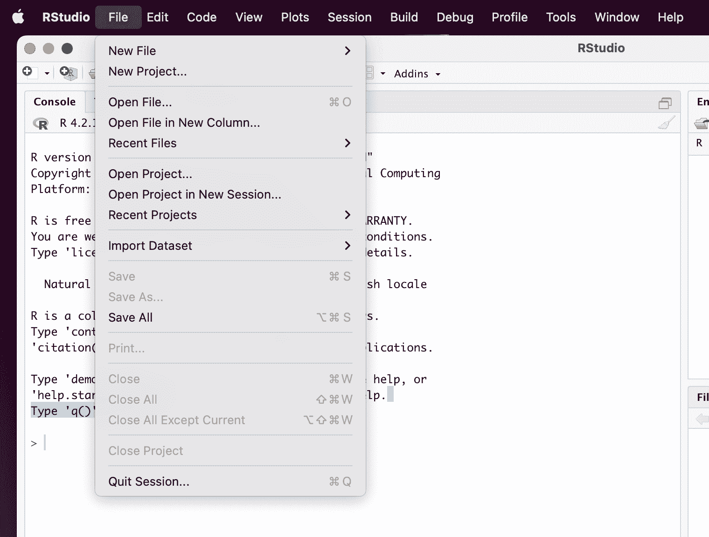
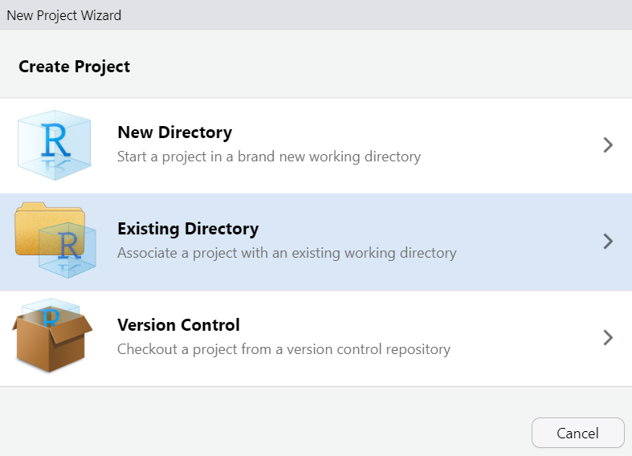
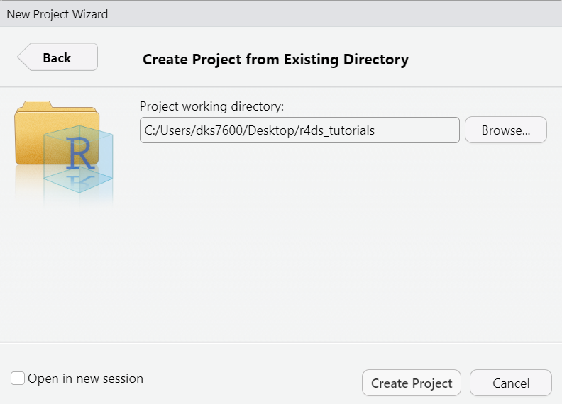

<!-- Modification of r4ds.tutorials author: David Kane -->

```{r setup, include = FALSE}
library(learnr)
#library(tutorial.helpers)
library(tidyverse)
library(nycflights13)
library(knitr)
library(gradethis)
library(tutorialExtras)

gradethis_setup()

knitr::opts_chunk$set(echo = FALSE)
knitr::opts_chunk$set(out.width = '90%')
options(tutorial.exercise.timelimit = 60, 
        tutorial.storage = "local")
```

```{r copy-code-chunk, child = system.file("child_documents/copy_button.Rmd", package = "tutorial.helpers")}
```

```{r, context = "server"}
grade_server("grade")
```

```{r Name}
question_text("Name:",
              answer_fn(function(value){
                              if(length(value) >= 1 ) {
                                return(mark_as(TRUE))
                                }
                              return(mark_as(FALSE) )
                              }),
              correct = "submitted",
              allow_retry = FALSE )
```

```{r}
grade_button_ui(id = "grade")
```


## Introduction
### 

This tutorial covers [Chapter 6 Workflow: scripts and projects](https://r4ds.hadley.nz/workflow-style.html) from [*R for Data Science (2e)*](https://r4ds.hadley.nz/) by Hadley Wickham, Mine Çetinkaya-Rundel, and Garrett Grolemund. You will learn two essential tools for organizing your code: scripts and projects.


## Scripts

So far, we have only worked in the R Console, but it's quite difficult to type more than a few lines of code into the Console at once. One solution is to use [R scripts](https://r4ds.hadley.nz/workflow-scripts.html#scripts), files which contain a permanent copy of our code.

### Task 1

Create an R script by clicking the `File >> New File` drop down menu at the top left of your RStudio Session, and then selecting `R Script`.

### 

An untitled, empty file should pop up above the R Console in the Source pane. By opening a script, you have caused the Source pane to open, the fourth [common pane within RStudio](https://docs.posit.co/ide/user/ide/guide/ui/ui-panes.html). (The three other panes are Console, Environment and Output. Within each pane, there are usually multiple tabs.)

You can also create a new R script using the keyboard shortcut `Command/Ctrl + Shift + N`. 

###

We need to save our file so that we can access our work later on. To keep our work organized we will want to save the file in a folder.

###

Let's make a folder, and call it `r4ds_tutorials`, and store it on our Desktop. You can manually do this on your computer or from the Console, run `dir.create("~/Desktop/r4ds_tutorials/")`. 

Note: This command will only work if `dir.exists("~/Desktop/")` returns `TRUE` (you should check this prior to trying the `dir.create()` function).

###

Helpful resources can be found [here](https://support.microsoft.com/en-us/office/create-a-new-folder-cbbfb6f5-59dd-4e5d-95f6-a12577952e17) for Windows, and [here](https://support.apple.com/guide/mac-help/organize-files-using-folders-mh26885/mac) for macOS.

###

**NOTE: Do not store this folder inside of a cloud storage directory such as OneDrive.** This can cause heaps of unforeseen problems for you in the future.

###

Save the file into this new folder. Name it `script-1.R`. (Note that R will provide the `.R` suffix, so you only need to type `script-1`.) 

###

Folder and file names should **ALWAYS** be machine and human readable. Meaning avoid spaces, symbols, and special characters and choose a meaningful name.


### Task 2

It is good practice to always start your script with the packages you need.

###

In your `script-1.R` file load `tidyverse` at the top of the document.

###

You should **NEVER** include install.packages() in a script you share.

###

Create a plot using the `mpg` dataset, add `aes()` with the `x` argument set to `drv`, and add `geom_bar()`

###

The key to using the script editor effectively is to memorize one of the most important keyboard shortcuts: `Cmd/Ctrl + Enter`.

###

Place your cursor in your plot code and click `Cmd/Ctrl + Enter` to run the code.


### Exercise 1

```{r scripts-1-q}
quiz(
  caption = "",
  question("Where should packages be loaded in your script?",
          answer("top", TRUE),
          answer("bottom"),
          answer("directly before the code that requires it"),
          answer("does not belong in script"),
	random_answer_order = TRUE,
	allow_retry = TRUE),
  question("Where should packages be installed in your script?",
          answer("top"),
          answer("bottom"),
          answer("directly before the code that requires it"),
          answer("does not belong in script", TRUE),
	random_answer_order = TRUE,
	allow_retry = TRUE),
  question("What is the 'shortcut' for running lines of code in a script?",
       answer("ctrl/cmd + enter", correct = TRUE),
       answer("ctrl/cmd + shift + enter"),
       answer("ctrl/cmd + shift + r"),
       answer("alt + enter"),
       answer("alt + r"),
       answer("alt + shift + r"),
       random_answer_order = TRUE,
       allow_retry = TRUE)
  
)
```


## Projects
###

In the previous section we created a folder that contains a script. However, how do we guarantee when we exit out of RStudio and re-open it that we will be working in the correct directory?

R has a powerful notion of the working directory. This is where R looks for files that you ask it to load, and where it will put any files that you ask it to save.

Shortly, we will create a new [RStudio project](https://docs.posit.co/ide/user/ide/guide/code/projects.html) for you to work in. Before we do this, it might be useful to understand where you are right now.

### Exercise 1

In the R Console, run `getwd()`. Copy and paste the result.

```{r project-1}
question_text(NULL,
    answer_fn(function(value){
                              if(length(value) >= 1 ) {
                                return(mark_as(TRUE))
                                }
                              return(mark_as(FALSE) )
                              }),
    allow_retry = TRUE,
    correct = "Submitted",
    try_again_button = "Edit Answer",
    incorrect = NULL,
    rows = 3)
```

### 

This function returns the "path" to your current R working directory. A path is simply the information which allows you to reach a location on your computer. In this case, if you wanted to find the folder from which R is running, you would follow the path returned by `getwd()`.

More info on paths can be found on the [UC Berkeley website](https://people.ischool.berkeley.edu/~kevin/unix-tutorial/section3.html).

### Exercise 2

Good data scientists keep their work organized. You should place your work in different [RStudio projects](https://docs.posit.co/ide/user/ide/guide/code/projects.html), which are simply folders (that is, directories) on your computer with some helper files. Each separate RStudio project is a folder within your main folder for your R work, i.e.,  `/Users/dkane/Desktop/projects/`. We use the terms "RStudio project" and "R project" interchangeably. 

###

**Read all of the instructions before starting this exercise.**

You will be locked out of this tutorial while making your project.

The first step is to click `File -> New Project` from the main menu:

```{r}

```

Select `Existing Directory`:

```{r}

```

Note: We already created a directory `r4ds_tutorials` earlier. If you do not have a directory where you want your project saved then you would instead select `New Directory`.


Navigate to the folder that you created earlier:

```{r}

```

Click "Create Project." 

Now that you have read all the directions, we can go through the steps.

But note that, when you create the new project **You will need to restart the tutorial**. Your R session will be located in this new project. For the rest of this tutorial, we will be working in `r4ds_tutorials`.

### 

Once you restart the tutorial, run `getwd()` in the Console. Copy and paste the result.

```{r projects-2}
question_text(NULL,
    answer_fn(function(value){
                              if(length(value) >= 1 ) {
                                return(mark_as(TRUE))
                                }
                              return(mark_as(FALSE) )
                              }),
    allow_retry = TRUE,
    correct = "Submitted",
    try_again_button = "Edit Answer",
    incorrect = NULL,
    rows = 3)
```

### 

Creating/opening an R project moves the R session to that directory. For example:


````
/Users/dks7600/Desktop/r4ds_tutorials/
````

###

As you advance in your data science skills you may also create projects from GitHub.


### Exercise 3

Going forward it is good practice to make sure you are always working in a project anytime you use RStudio.

###

We recommend opening RStudio by using your `.Rproj` file within the project folder. Navigate to your project directory on your computer and double click the .Rproj file shown below to open RStudio


```{r}
include_graphics("images/existing_project_3.png")
```

###

You can check which project you are working on by looking in the upper right corner of RStudio.

```{r}
include_graphics("images/existing_project_4.png")
```

###

```{r projects-3}
question_text("Are you currently working in an R Project?",
    answer_fn(function(value){
                              if(length(value) >= 1 ) {
                                return(mark_as(TRUE))
                                }
                              return(mark_as(FALSE) )
                              }),
    allow_retry = TRUE,
    correct = "Submitted",
    try_again_button = "Edit Answer",
    incorrect = NULL,
    rows = 3)
```

## Summary

### 

This tutorial covered [Chapter 6 Workflow: scripts and projects](https://r4ds.hadley.nz/workflow-style.html) from [*R for Data Science (2e)*](https://r4ds.hadley.nz/) by Hadley Wickham, Mine Çetinkaya-Rundel, and Garrett Grolemund. You learned two essential tools for organizing your code: scripts and projects.

Once you are finished:

-   Click the 'Download Grade' button below. This will download an html document of your grade summary.
-   Submit the downloaded html to your learning management system.

```{r}
grade_print_ui("grade")
```
